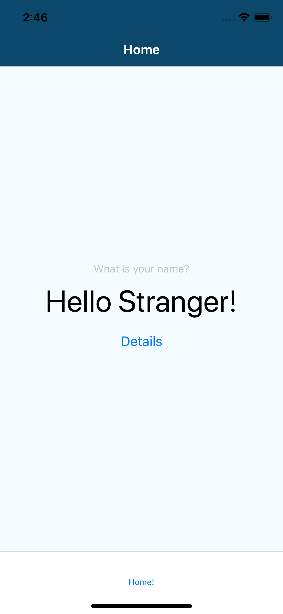
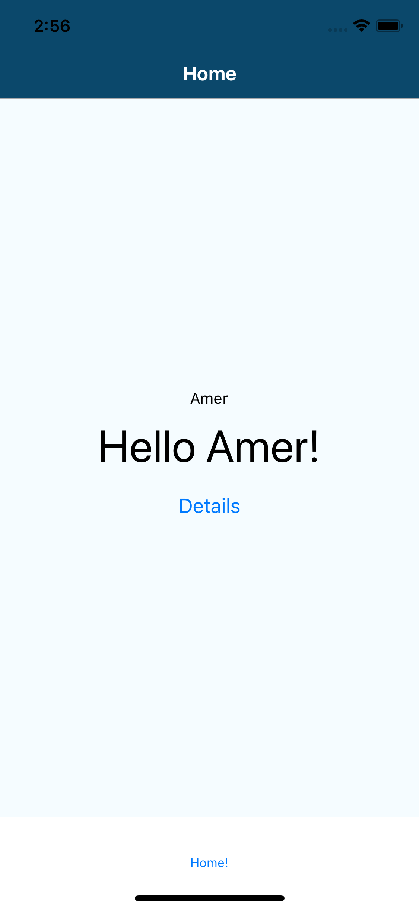
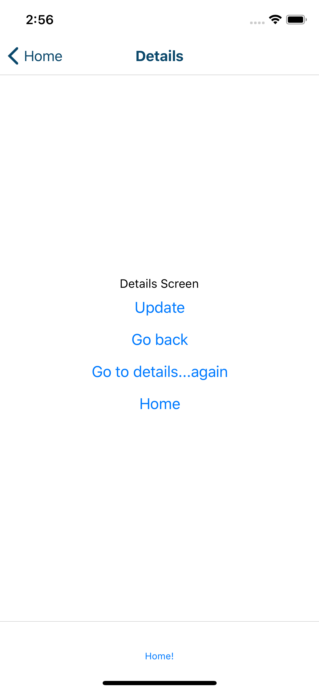
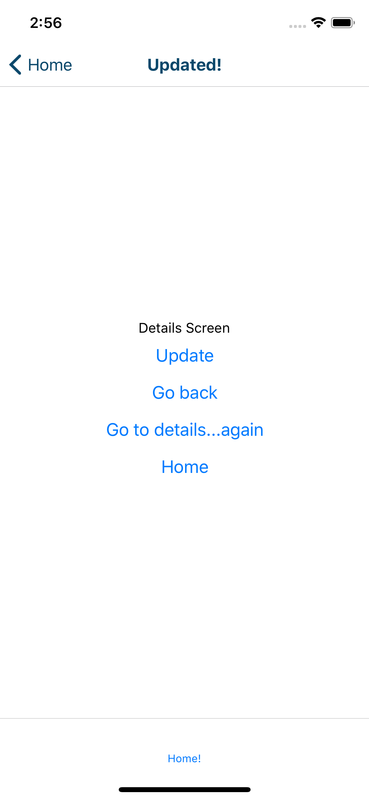
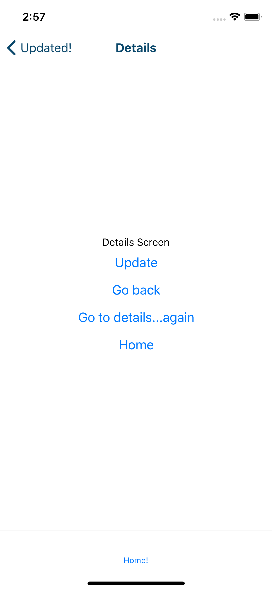

<h1>HELLO REACT NAVIGATION</h1> 
<i>This app is built using react-native cli</i>

<h4>For this app you will need:</h4>

<ul>
<li>Terminal</li>
<li>npm cli</li>
<li>react-native cli</li>
<li>XCode</li>
</ul>

<h4>To run this app:</h4>

<ol>
<li>npm install</li>
<li>npm start</li>
<li>react-native run-ios</li>
</ol>

<h4>So what is this app?</h4>

React native, based on the user input, returns a custom greeting.It also has the basics of react navigation.

This app currently has two screens: 

<ol>
<li>Main</li>
<li>Details</li>
</ol>

The <em>Main</em> screen asks the user for their name and greets them. <em>Main</em>

<h4>What is react navigation?</h4>

React navigation is a react-native lirary to manage the presentation of, and transition between, multiple screens. 

<h4>Screenshots:</h4>

<h5>App on start:</h5>

<h5>When name is entered:</h5>

<h5>Details</h5>

<h5>When update is clicked</h5>

<h5>When details..again is clicked</h5>

